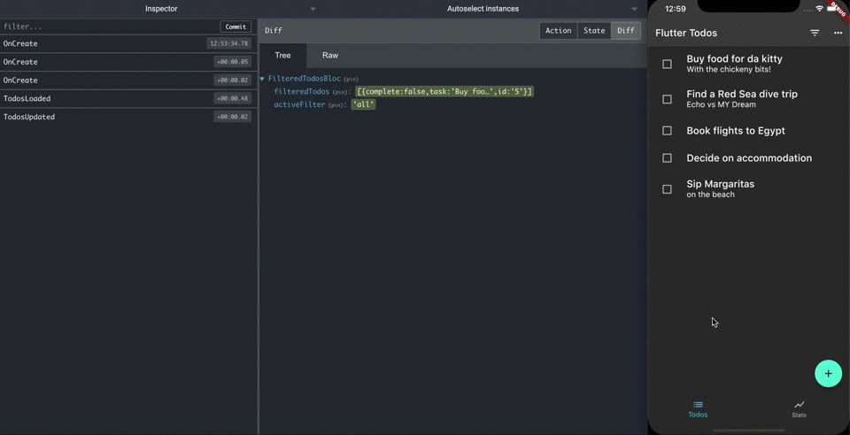

# Remote Devtools for flutter_bloc

Remote Devtools support for Blocs of [flutter_bloc](https://github.com/felangel/bloc/tree/master/packages/flutter_bloc).

N.B. `Cubit` is not supported



## Installation

Add the library to pubspec.yaml:

```yaml
dependencies:
  flutter_bloc_devtools: ^0.1.0
```

## BlocObserver configuration

Add `RemoteDevToolsObserver` to your `Bloc.observer`:

```dart
void main() async {
  final observer = RemoteDevToolsObserver('192.168.1.7:8000');
  await observer.connect();
  Bloc.observer = observer;

  runApp(const CounterApp());
}
```

## Using remotedev

Use the Javascript [Remote Devtools](https://github.com/zalmoxisus/remotedev-server) package. Start the remotedev server on your machine

```bash
npm install -g remotedev-server
remotedev --port 8000
```

Run your application. It will connect to the remotedev server. You can now debug your flutter_bloc application by opening up `http://localhost:8000` in a web browser.

## Making your Events and States Mappable

Events and States have to implements `Mappable`:

```dart
class CounterState extends Equatable implements Mappable {
  final int counter;

  const CounterState({
    this.counter,
  });

  @override
  List<Object> get props => [
        counter,
      ];

  @override
  Map<String, dynamic> toMap() => {
        'counter': counter,
      };
}
```

## Examples

- [Counter](exampe/counter)
- [Todos](example/flutter_todos)
